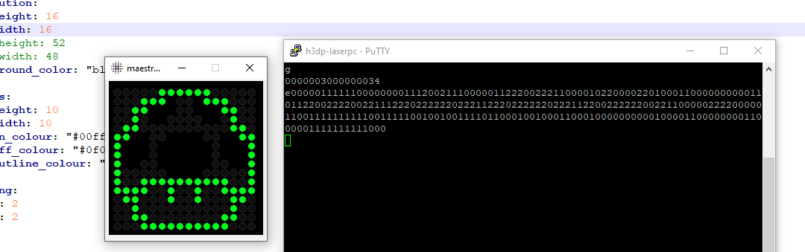

# AlfaZeta FlipDots Maestro Emulator

#### What is AlfaZeta FlipDots Maestro? 

An exerpt from the AlfaZeta Website: The Maestro system is a complete solution which is delivered together with a Linux based hardware controller. It connects via Wifi to LAN and via Ethernet cable to a network of RS485 converters feeding signal directly to flip dot panels.

See more at: https://flipdots.com/en/software/
  

#### What can I do with this emulator?
This emulator was written to allow programmers the opportunity to code maestro 'FlipApps' without needing to purchase the maestro system or any hardware.  This client+server pair follows the FlipDots Maestro protocol, handling the OpCodes provided in the protocol specification, providing a system that will behave in the exact manner of the real hardware implementation.
  

#### Protocol Implementation
<table>
  <tr><td>OpCode</td><td>Description</td><td>Emul Status</td></tr>
  <tr><td>0x0</td><td>Display a light pixel at the given coordinates</td><td>Completed</td></tr>
  <tr><td>0x1</td><td>Display a dark pixel at the given coordinates</td><td>Completed</td></tr>
  <tr><td>0x2</td><td>Display a transparent pixel at the given coordinates</td><td>Completed</td></tr>
  <tr><td>0x3</td><td>Display a pixel of a specific color, at the given coordinates</td><td>Completed</td></tr>
  <tr><td>0x4</td><td>Display a frame</td><td>Completed</td></tr>
  <tr><td>0x5</td><td>Send FlipApp’s UID</td><td>TBC</td></tr>
  <tr><td>0x6</td><td>Get display resolution</td><td>TBC</td></tr>
</table>
